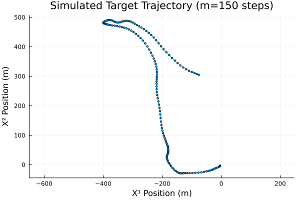

## HA1 Report: A hidden Markov model for mobility tracking

### Problem 1: Motion model

#### 1. Is $\{X_n\}_{n \in \mathcal{N}}$ a Markov chain?

No. The definition of a Markov chain requires that the probability distribution of the next state of kinematics-vector $X_{n+1}$ depends only on the current state $X_n$. 

In the given model, the next state $X_{n+1}$ depends not only on the current state $X_n$, but also on the current driving command $Z_n$, where $\{Z_n\}_{n \in \mathcal{N}}$ is an independent Markov chain. Thus knowing $X_n$ alone is insufficient to determine the distribution of $X_{n+1}$, which means $\{X_n\}_{n \in \mathcal{N}}$ does not satisfy the Markov property. 

The noise $W_{n+1}$ is mutually independent completely stochastic component determined at time-step $n+1$. This means we can't speak of any prior knowledge about the noise and it can be essentailly ignored for the Markov chain analysis. 

#### 2. Is $\{\tilde{X}_n\}_{n \in \mathcal{N}}$ a Markov chain?

Yes. In this case, in order to satify the Markov property, the distribution of the next state $\tilde{X}_{n+1}$ must depend only on the current state, now defined as $\tilde{X}_{n}=(X_n^T, Z_n^T)$. 

Again, according to the given model, to determine the next state we must know $X_n$, $Z_n$ and mutually independent $W_{n+1}$. Thus knowing $X_n$ and $Z_n$ is technically enough to determine the next state's probability distribution. 

Since now knowledge of both $X_n$ and $Z_n$ is coupled within $\tilde{X}_{n}$, knowing $\tilde{X}_{n}$ is indeed enough to determine the probability distribution of $\tilde{X}_{n+1}$.  

#### 3. Trajectory simulation.

The presented figure depicts a reasonable trajectory, that is:
- the path is continuous and smooth,
- the direction changes seem consistent with the simulated driving commands,
- the transition matrix $P$ makes the driving command likely to persist for several steps (0.8 probability), which explains the relatively straight segments of the trajectory between major turns,
- the path is not perfectly straight due to the introduced noise, as expected. 

### Problem 2: Observation model

#### 1. *Convincing myself* that $\{(\tilde{\mathbf{X}}_n, \mathbf{Y}_n)\}_{n \in \mathbb{N}}$ forms a hidden Markov model.

1.1 Some setup:
- Hidden State: $\tilde{\mathbf{X}}_n = (\mathbf{X}_n^T, Z_n^T)^T$. Let $\mathbf{pos}_n = (X^1_n, X^2_n)^T$ be the position component of $\mathbf{X}_n$.
- Observation: $\mathbf{Y}_n = (Y^1_n, \dots, Y^s_n)^T$ ($s=6$).
- Observation Model: $Y^{\ell}_n = \nu - 10\eta \log_{10}(\|\mathbf{pos}_n - \boldsymbol{\pi}_\ell\|) + V^{\ell}_n$, with $V^{\ell}_n \sim \mathcal{N}(0, \zeta^2)$ i.i.d. noise ($\nu=90, \eta=3, \zeta=1.5$), independent of $\{\tilde{\mathbf{X}}_k\}$.

1.2 Solution:   
1.2.1 Verifying whether our hidden state is a Markov Chain:
* The hidden state process is $\{\tilde{\mathbf{X}}_n\}_{n \in \mathbb{N}}$.
* From Problem 1, we established that this process satisfies the Markov property: the distribution of $\tilde{\mathbf{X}}_n$ depends only on $\tilde{\mathbf{X}}_{n-1}$.
* This fulfills the first requirement for a hidden Markov model         

1.2.2 Verifying conditional independence of our observations:
* The observation $Y^{\ell}_n$ depends on the current position $\mathbf{pos}_n$ (determined by $\tilde{\mathbf{X}}_n$) and the current independent noise $V^{\ell}_n$.
* Since the noise vector $\mathbf{V}_n = (V^1_n, \dots, V^s_n)^T$ is independent of the state process and its components are independent, the observation $\mathbf{Y}_n$ is conditionally independent of past states and observations given the current state $\tilde{\mathbf{X}}_n$.
* This fulfills the second requirement, i.e.: $p(\mathbf{y}_n | \tilde{\mathbf{x}}_0, \dots, \tilde{\mathbf{x}}_n, \mathbf{y}_0, \dots, \mathbf{y}_{n-1}) = p(\mathbf{y}_n | \tilde{\mathbf{x}}_n)$.
* Therefore, $\{(\tilde{\mathbf{X}}_n, \mathbf{Y}_n)\}$ forms a hidden Markov model.

#### 2. Transition density $p(\mathbf{y}_n \mid \tilde{\mathbf{x}}_n)$.

* This density is the conditional probability density of $\mathbf{Y}_n$ given $\tilde{\mathbf{X}}_n = \tilde{\mathbf{x}}_n$.
* Let $\mathbf{pos}_n = (x^1_n, x^4_n)^T$ be the position extracted from $\tilde{\mathbf{x}}_n$.
* Let's define the conditional mean 
    $$
    \mu^{\ell}(\tilde{\mathbf{x}}_n) = \nu - 10\eta \log_{10}(\|\mathbf{pos}_n - \boldsymbol{\pi}_\ell\|)
    $$
* The conditional distribution is 
    $$
    Y^{\ell}_n | \tilde{\mathbf{x}}_n \sim \mathcal{N}(\mu^{\ell}(\tilde{\mathbf{x}}_n), \zeta^2)
    $$
* Due to noise independence, the components of $\mathbf{Y}_n$ are conditionally independent given $\tilde{\mathbf{x}}_n$.
* The joint density is the product of individual Gaussian PDFs:
    $$
    p(\mathbf{y}_n \mid \tilde{\mathbf{x}}_n) = \prod_{\ell=1}^{s} p(y^{\ell}_n | \tilde{\mathbf{x}}_n) = \prod_{\ell=1}^{s} \left[ \frac{1}{\sqrt{2\pi}\zeta} \exp\left(-\frac{(y^{\ell}_n - \mu^{\ell}(\tilde{\mathbf{x}}_n))^2}{2\zeta^2}\right) \right]
    $$
* Combining terms gives the multivariate Gaussian density:
    $$
    p(\mathbf{y}_n \mid \tilde{\mathbf{x}}_n) = \frac{1}{(2\pi)^{s/2} \zeta^s} \exp\left(-\frac{1}{2\zeta^2} \sum_{\ell=1}^{s} (y^{\ell}_n - \mu^{\ell}(\tilde{\mathbf{x}}_n))^2\right)
    $$
* Substituting known constants ($s=6$, $\zeta=1.5$, $\nu=90$, $\eta=3$):
    $$
    p(\mathbf{y}_n \mid \tilde{\mathbf{x}}_n) = \frac{1}{(2\pi)^{3} (1.5)^6} \exp\left(-\frac{1}{2(1.5)^2} \sum_{\ell=1}^{6} \left(y^{\ell}_n - \left(90 - 30 \log_{10}(\|(x^1_n, x^4_n)^T - \boldsymbol{\pi}_\ell\|)\right)\right)^2\right)
    $$

This is the required transition (observation) density.

### Problem 3: Mobility tracking using SMC methods (SIS)

### Problem 4: Mobility tracking using SMC methods (SISR)

### Problem 5: SMC-based model calibration

